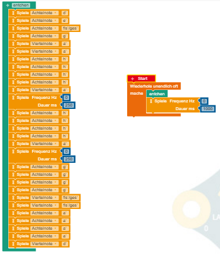
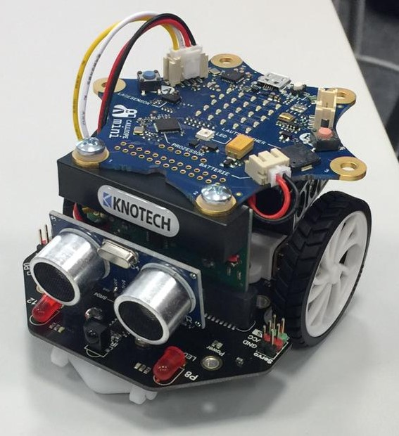

# Calliope mini  und Calli:bot - Eindrücke und Erfahrungen
_Autoren: Ahlam Jiddane, Jennifer Hübner, Jakob Hauge, Hakim Latifi_

## Einführung
Im Rahmen des Studieneinführungsmodules im ersten Semester des B. Eng. Elektrotechnik an der Hochschule Bremen sollte ein bereits bestehendes 
Schulprojekt evaluiert werden.
Das Schulprojekt wurde in einer Bremer Grundschule durchgeführt und war eins von mehreren Pilotprojekte zu den Calliope mini, wobei die Schülerinnen 
und Schüler, nach Anleitung der Lehrkräfte, selber die Programme schrieben. 
Wir befassten uns sowohl mit dem Calliope mini als auch mit dem dazugehögrigen Robotermodul Calli:bot 
und testeten jeweils verschiedene Programme aus. Bei jedem Versuch 
schrieben wir die von uns gesehenen Vor- und Nachteile auf. 

## Calliope mini


### Allgemeines

Der Calliope mini besteht aus einer Platine mit fest eingebauten Elementen.
Diese sind der Microcontroller, 25 quadratisch angeordnetete LED´s, ein
Lautsprecher, ein Mikrofon, einem Tempreatursensor, einem Gyroskop/ 
Beschleunigungssensor sowie diversen Schnittstellen.
Dadurch das keine Lötvorgänge benötigt werden, wird das Verletzungpotential
minimiert. Im Lieferumfang sind des Weiteren auch eine Kurzanleitung, ein
USB-Kabel (A-Male zu Micro B) und ein Batteriehalter für 2 AAA Batterien sowie diverse Aufkleber. Diese können hinterher
natürlich nicht nur an den von entscheidungsbefugten Personen definierten
Orten kleben sondern auch beispielsweise am Tischnachbarn.

### Programmierumgebung

Die Erstellung des Programmcodes erfolgte in unserem Falle über die Webseite
https://lab.open-roberta.org/# , welche auch vom Begleitmaterial des Calliope mini vor-
geschlagen wird. Diese Webseite besteht aus einem grafischen Interface, welches 
den Schülern das Programmieren spielerisch näher bringt. Auf der Webseite
gibt es die Möglichkeit sich anzumelden, aber das ist auf freiwilliger Basis.
Der Vorteil der Anmeldung ist, dass eigene Programme gespeichert werden können. 
Für die Anmeldung auf der Webseite wird nur ein Nutzername und Passwort benötigt. 
Optional kann man auch eine E-Mailadresse oder einen Klarnamen angeben.

Die Programmierumgebung ist in 2 Bereiche aufgeteilt und zwar für Anfänger 
und Fortgeschrittene, wobei die Anfängerversion weniger Optionen bietet als die
Fortgeschritteneversion. Wir nutzten ausschließlich die Umgebung für Fortgeschrittene, da diese 
größere Freiheiten zuließ. Dies ist teilweise darauf zurückzuführen, dass wir
alle bereits Vorkenntnisse mitbrachten. Es half uns auch, dass die Befehle
als eine Art Puzzle gestaltet sind, bei dem die einzelnen Teilelemente, wie 
beispielsweise Variablen, mit unterschiedlichen Farbmarkierungen versehen sind.
In der Lehre kann dies dazu führen, dass nicht erst theoretisch erklärt werden
muss was beispielsweise eine Endlossschleife ist oder wie sie funktioniert bevor
Schüler diese intuitiv richtig einsetzen. Auch ist es möglich sich das entstandene
Programm als C++ Code anzeigen zu lassen. Durch die Aneinanderreihung von 
mehreren Bausteinen entsteht ein Programmcode. Möchte man beispielsweise ein
Lied abspielen so muss man die Klangbefehle aller einzelner Töne aneinander reihen.
Auf Grund der Limitierung beim Copy-Paste-Verfahren kann immer nur ein Baustein 
dupliziert werden, was in einem deutlich erhöhtem Arbeitsaufwand resultiert.
Die Übertragung des Programmcodes vom Rechner auf den Calli:bot erfolgt als .hex-Datei
via des mitgelieferten Kabels. Das Programm startet darauf hin automatisch, es kann
aber jederzeit erneut gestartet werden indem man auf den 'Reset'-Knopf drückt.

### Alle meine Entchen
Als erstes programmierten wir eine Abfolge von Tönen um uns mit der Programmierumgebung
vertraut zu machen. Wir erweiterten dieses Vorgehen dorthin, dass der Calliope
ein einfaches Lied abspielen konnte. Dafür wählten wir 'Alle meine Entchen'
da dieses nicht nur mit seiner Kürze und Einfachkeit sondern auch mit 
dem Wiedererkunnungswert hervorstach.

Bei der Erstellung des Programmcodes stellte es sich als Problem heraus, dass jede Note und 
Pause einzeln definiert werden muss. Bei den Pausen muss man die zeitliche Abstimmung beachten, 
da es relativ schnell unrhythmisch klingt.

 

\newpage

Der selbe Programmcode wie er von OpenRoberta angezeigt werden kann:

```
#define _GNU_SOURCE

#include "MicroBit.h"
#include "NEPODefs.h"
#include <list>
#include <array>
#include <stdlib.h>
MicroBit _uBit;

void entchen();

int main()
{
    _uBit.init();
    
    while ( true ) {
        entchen();
        _uBit.soundmotor.soundOn(0); _uBit.sleep(1000); _uBit.soundmotor.soundOff();
        _uBit.sleep(_ITERATION_SLEEP_TIMEOUT);
    }
    release_fiber();
}

void entchen() {
    _uBit.soundmotor.soundOn(293.665); _uBit.sleep(250); _uBit.soundmotor.soundOff();
    _uBit.soundmotor.soundOn(329.628); _uBit.sleep(250); _uBit.soundmotor.soundOff();
    _uBit.soundmotor.soundOn(369.994); _uBit.sleep(250); _uBit.soundmotor.soundOff();
    _uBit.soundmotor.soundOn(391.995); _uBit.sleep(250); _uBit.soundmotor.soundOff();
    _uBit.soundmotor.soundOn(440); _uBit.sleep(500); _uBit.soundmotor.soundOff();
    _uBit.soundmotor.soundOn(440); _uBit.sleep(500); _uBit.soundmotor.soundOff();
    _uBit.soundmotor.soundOn(493.883); _uBit.sleep(250); _uBit.soundmotor.soundOff();
    _uBit.soundmotor.soundOn(493.883); _uBit.sleep(250); _uBit.soundmotor.soundOff();
    _uBit.soundmotor.soundOn(493.883); _uBit.sleep(250); _uBit.soundmotor.soundOff();
    _uBit.soundmotor.soundOn(493.883); _uBit.sleep(250); _uBit.soundmotor.soundOff();
    _uBit.soundmotor.soundOn(440); _uBit.sleep(500); _uBit.soundmotor.soundOff();
    _uBit.soundmotor.soundOn(0); _uBit.sleep(250); _uBit.soundmotor.soundOff();
    _uBit.soundmotor.soundOn(493.883); _uBit.sleep(250); _uBit.soundmotor.soundOff();
    _uBit.soundmotor.soundOn(493.883); _uBit.sleep(250); _uBit.soundmotor.soundOff();
    _uBit.soundmotor.soundOn(493.883); _uBit.sleep(250); _uBit.soundmotor.soundOff();
    _uBit.soundmotor.soundOn(493.883); _uBit.sleep(250); _uBit.soundmotor.soundOff();
    _uBit.soundmotor.soundOn(440); _uBit.sleep(500); _uBit.soundmotor.soundOff();
    _uBit.soundmotor.soundOn(0); _uBit.sleep(250); _uBit.soundmotor.soundOff();
    _uBit.soundmotor.soundOn(391.995); _uBit.sleep(250); _uBit.soundmotor.soundOff();
    _uBit.soundmotor.soundOn(391.995); _uBit.sleep(250); _uBit.soundmotor.soundOff();
    _uBit.soundmotor.soundOn(391.995); _uBit.sleep(250); _uBit.soundmotor.soundOff();
    _uBit.soundmotor.soundOn(391.995); _uBit.sleep(250); _uBit.soundmotor.soundOff();
    _uBit.soundmotor.soundOn(369.994); _uBit.sleep(500); _uBit.soundmotor.soundOff();
    _uBit.soundmotor.soundOn(369.994); _uBit.sleep(500); _uBit.soundmotor.soundOff();
    _uBit.soundmotor.soundOn(440); _uBit.sleep(250); _uBit.soundmotor.soundOff();
    _uBit.soundmotor.soundOn(440); _uBit.sleep(250); _uBit.soundmotor.soundOff();
    _uBit.soundmotor.soundOn(440); _uBit.sleep(250); _uBit.soundmotor.soundOff();
    _uBit.soundmotor.soundOn(440); _uBit.sleep(250); _uBit.soundmotor.soundOff();
    _uBit.soundmotor.soundOn(293.665); _uBit.sleep(500); _uBit.soundmotor.soundOff();
}
```

### Das Thermometer

Auf der Platine befindet sich ein Temperatursensor mit dem sich die Temperatur messen lässt.
Die Temperatur wird in Grad Celsius angegeben und kann als Zahl auf dem LED-Raster dargestellt werden,
wobei die einzelnen Ziffern nacheinander durchlaufen. 
In der Programmierumgebung ohne Schleife wird die Temperatur nur einmal angezeigt, aber
sobald die Funktion sich in einer Endlosschleife befindet wird die Temperatur wiederholt angezeigt.
Der Temperatursensor braucht sehr lange bis er sich auf eine neue Temperatur einpendelt. Deshalb haben
wir jeweils 10 Minuten gewartet bevor wir den Wert des Calliopes aufgenommen haben.


+----------------------+--------------------+-------------------------+-------------+
| Versuchsaufbau 	   |    Thermometer     |         Calliope        | Unterschied |
+======================+====================+=========================+=============+
| Raumtemperatur       |       	19,7        |      	    21            |   	1,3		|
+----------------------+--------------------+-------------------------+-------------+
| Außenbereich     	   |       	05,7		|         	07			  |     1,3 	|
+----------------------+--------------------+-------------------------+-------------+
| Mensa  		   	   |       	19,8		|         	19			  |     0,8   	|
+----------------------+--------------------+-------------------------+-------------+
| Heizung   	   	   |     	38,0		|        	34			  |    	4,0	    |
+----------------------+--------------------+-------------------------+-------------+


\newpage

## Calli:bot




### Allgemeines 

Der Calli:bot ist eine Roboterbausatz, der die Calliope Platine als Steuereinheit verwendet und weitere Funktionen und Sensoren zur Verfügung stellt. 
Die wichtigsten Bestandteile der Robotereinheit sind die Räder, die beiden Inrarotsensoren und der Ultraschallsensor.
Im Calli:bot-Paket ist der Calliope mini nicht enthalten. 
Der Neupreis für den Calli:bot liegt bei 44,90€ (Quelle:Knotech.Shop, Stand:02.01.2020). 
Der Zusammenbau ist simpel, da eine Schritt-für-Schritt-Anleitung vorhanden ist. 
Es wird für den Zusammenbau nur ein Schraubendreher benötigt. 
Hierdurch sollte der Zusammenbau eines Calli:bots kein Problem darstellen.
Das einzige Problem hinsichtlich des Zusammenbaus bei Schülern könnte sein, dass Kleinteile verloren gehen. 
Nach dem Zusammenbau ist aufgefallen, dass der Ultraschallsensor nur über die Pins befestigt ist, welches 
ein Problem darstellt, falls sich die Pins verbiegen oder beim Spielen mit dem Calli:bot beziehungsweise der Lagerung des Calli:bots etwas gegen den 
Ultraschallsensor drückt.  
Ein weiterer Punkt der auffiel, ist das die Servo- und Power-Pins keine Abdeckung besitzen. Daher können diese
 schnell verbogen werden, was Funktionsstörungen auslösen könnte.
Bei den Rädern fiel auf, dass die Profile der Gummireifen in zwei unterschiedliche Richtungen zeigen.
Die Programmierung wird hierbei auch über die Webseite open-roberta durchgeführt.


 
### Der Calli:bot fährt
Der Calli:bot kann vorwärs fahren, da an beiden hinteren Rädern jeweils 2 Elektromotoren verbaut sind. 
Das Problem ist, dass der Calli:bot bei dem Befehl geradeaus zu fahren eine Bogenlampe mit etwa 28° Abweichung fuhr. 
Der erste Verdacht war, dass der Calli:bot wegen den unterschiedlichen Reifenprofilen die Bogenlampe fährt.
Deswegen wurden weitere Tests gemacht, um den Calli:bot gerade fahren zu lassen. 
Der erste Testablauf war die Änderung des Radprofils.
Das Radprofil war standartmäßig ein Fischgrätenmuster in entgegengesetzte Richtungen. 
Ein weiters Radprofil, welches getestet wurde, war ein Geradliniges, mit mehreren Rillen nebeneinander. 
Dieses Radprofil stammt von der NIBOBee, welcher mit besagtem Muster gerade fährt.
Der Calli:bot hatte nun eine Abweichung von 25° Grad von der idealen Linie. 
Der letzte Versuchsteil zum Punkt Radprofil war es den Calli:bot ohne Gummiüberzug fahren zu lassen.
Dabei stellte sich heraus, dass das Problem nicht am Radprofil lag, 
da der Calli:bot auch ohne Reifengummi noch immer eine Bogenlampe mit etwa 17° Abweichung fuhr.
Durch diese Ergebnisse, wird der Fehler beim Antrieb vermutet. 
Man kann im Programmcode die einzelnen Antriebe mit unterschiedlichen Stärken einstellen. 
Nach mehrere Testdurchläufe des Calli:bots mit dem Standart Radprofil,  
stellte sich heraus, dass der recte Antrieb schneller ist als der linke.
Bei dieser Problematik fährt der Calli:bot eine Linkskurve.
Das bestmögliche Ergebnis stellt sich nur unter bestimmten Vorraussetzungen für das Standart Radprofil ein,
wenn die Streckenlänge 2m beträgt und die Antriebsgeschwingkeiten angepasst sind.
Folgende Anpassungen müssen im Programm gemacht werden:  
Der rechte Antrieb auf 41,5% und der linke Antrieb auf 50% Antriebsgeschwindigkeit.
Nach der Versuchslänge von 2m wird der Calli:bot, wie vorher, seine Bogenlampe fahren. 

### Die Abstandsmessung mithilfe des Ultraschallsensors


Als weiteren Versuch haben wir uns für die Abstandsmessung entschieden um den
Ultraschallsensor zu testen. Bei diesem Versuch stand der Calli:bot im
stillen Zustand vor einer schwarzen Tür. Um Kontrollwerte zu erfassen stand der Calli:bot auf einem Gliedermaßstab.
Das Programm startet mit dem Durchlauf einer Endlosschleife, welche den gemessenen Abstand als Ziffern in cm auf dem LED Feld anzeigt.
Zu beachten bei der Darstellung des Abstandes ist, dass ein Wartebefehl eingefügt werden muss, damit die Abstände überhaupt lesbar sind. 
Dann startet er die Schleife immer wieder neu bis sie manuell unterbrochen wird.
Wir haben dann mit den Calli:bot 6 Entfernungen gemessen. Wir haben folgende
Abstände mit den Calli:bot getestet: 5 cm, 10 cm, 15cm, 50 cm, 100cm, 150cm und 200cm. 
In der nachfolgenden Tabelle sind die Ergebnisse dokumentiert.

+----------+-----------------------+-------------+
| Abstand  | Dargestellter Abstand | Unterschied |
+==========+=======================+=============+
|    5 cm  |            5          |      0      |
+----------+-----------------------+-------------+
|   10 cm  |           10          |      0      |
+----------+-----------------------+-------------+
|   15 cm  |           15          |      0      |
+----------+-----------------------+-------------+
|   50 cm  |           52          |      2      |
+----------+-----------------------+-------------+
|  100 cm  |          103          |      3      |
+----------+-----------------------+-------------+
|  150 cm  |          155          |      5      |
+----------+-----------------------+-------------+
|  200 cm  |          208          |      8      |
+----------+-----------------------+-------------+


Durch die Erfassung der Werte ergab sich, dass der Calli:bot auf kleinen Maßen
relativ genau ist, aber Schwierigkeiten hat bei der Messung von größeren 
Entfernungen. Unsere Vermutung für die Ungenauigkeit ist, dass der Calli:bot beim Messen ein freies Feld benötigt da Ultraschallwellen sich kegelförmig 
ausbreiten.

## Liniensensor
Zuletzt testeten wir die eingebauten Infrarotsensoren um mit ihnen eine Linienautomatik zu erstellen. Dabei soll der Calli:bot schwarzen Linien folgen, welche 
im Vorfeld auf einer weißen Unterlage gezeichnet werden. Außerdem soll er abweichende Linien erkennen und ihnen folgen können. Der Calli:bot fährt 
geradeaus bis einer der beiden Infrarotsensoren eine Linie registriert. Nach der Erkennung soll der Calli:bot sich neu ausrichten und dann bis zur 
nächsten Linie weiter fahren. Es fiel auf das der Calli:bot deutliche Kontraste benötigt, da alles das dunkler als weiß war als Linie erkannt wurde.
Der Krümmungsgrad der Kurven darf nicht zu groß werden, da der Calli:bot ansonsten nicht mehr klar erkennen kann in welche Richtung er weiterfahren soll.

 


## Ausblick in die Zukunft
Anfänglich war geplant auch einen Parkour zu bauen in dem der Calli:bot mit Hilfe seines Abstandsensor selbstständig fährt. Dies wurde aus zeitlichen Gründen 
aber ebenso wenig durchgeführt wie die Integration des Mikrofons und die Anbindung von externen Sensoren über die vorhanden Schnittstellen. Es wurde auch
nicht untersucht inwiefern andere, auf dem Markt erhältliche, Plattformen als mögliche Alternative zur Verfügung stehen.

## Fazit
Der Calliope und der Calli:bot sind für den angedachten Zweck der spielerischen Vermittlung von Progammierkenntnissen prinzipiell geeignet, trotz ihrer 
Zerbrechlichkeit. Gerade die angebotene Benutzeroberfläche ist für Einsteiger im jüngeren Alter von ansprechender Natur. Allerdings stellt sich uns 
die Frage bezüglich der Sinnhaftigkeit einer Vermittlung von Programmierkenntnissen im Grundschulalter. Auf Grund mangelnder didaktischer und 
pädagogischer Kenntnisse können wir aber nicht eine abschließende Stellung dazu beziehen.