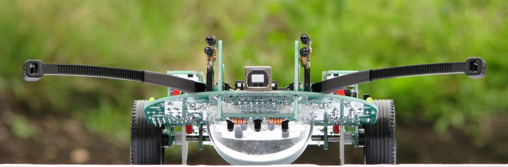
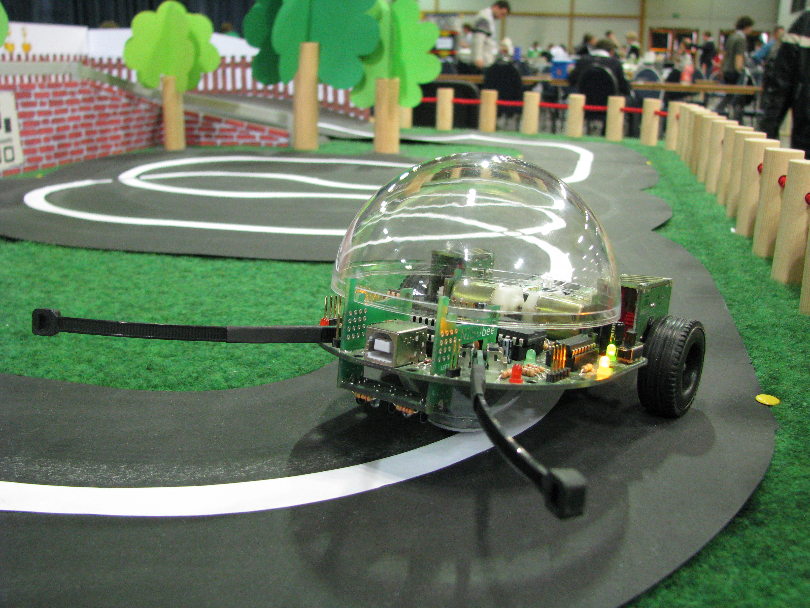

Vorgedachtes
============

.. _Vordenker für Bremen: https://www.vordenkerfuerbremen.de/start
.. _ArcelorMittal: https://bremen.arcelormittal.com/Home/
.. _NIBOBee: http://www.nicai-systems.com/de/nibobee
.. _nicai-systems: http://www.nicai-systems.com/de/
.. _RaspberryPi: https://www.raspberrypi.org

Ziel der Teilnahme "`Vordenker für Bremen`_" der Firma
ArcelorMittal_ Bremen GmbH ist, eine Lehr- und
Projekteinheit in Form eines Schülerlabors zur MINT-Förderung für
Schülerinnen und Schüler der dritten und vierten Jahrgangsstufe zusammen
mit der Grundschule Rablinghausen und der Hochschule Bremen, Fakultät 4,
Elektrotechnik und Informatik, anzubieten.

Die Idee im Kopf
----------------

Genau, zuverlässig, effizient und hochminiaturisiert sowie vernetzt zu
messen und zu überwachen ist der Schlüssel, industrielle
Produktionsprozesse kostengünstiger und ressourcenschonender zu machen.
In der Konsumelektronik wünschen sich Nutzer immer mehr Komfort,
Energieersparnis und Langlebigkeit. Auch Gefahren für Mensch und Gut
sollen rechtzeitig erkannt werden, so dass schnell die richtigen
Maßnahmen ergriffen und eingeleitet werden.

In diesen Aufgaben liegt das große Potential von multi-physikalischen,
technologisch-gemischten Mikrosystemen und deren Fähigkeit,
Beschleunigung, Druck, Entfernung, Temperatur, Durchfluss, Licht,
chemische Konzentration und Vieles mehr zu messen. Sie erfüllen bereits
heute höchste Anforderungen in der Industrie-, und Automobiltechnik bis
hin zur Unterhaltungselektronik. Sie ermöglichen auch den Aufbau von
großen intelligenten Netzwerken, z. B. zur Erdbebenvorwarnung durch
flächendeckende Überwachung seismischer Aktivität oder zur
Unfallvermeidung durch intensive Beobachtung von kritischen
Materialeigenschaften.

Ein aktuelles Problem ist die industrienahe Nachwuchsförderung in den
relevanten MINT-Fächern an den Schulen, um junge Menschen frühzeitig für
Technik und Naturwissenschaften zu begeistern.

Eine Möglichkeit, derartige Technologien auch in Schul- und
Hochschulbudgets nutzbar zu machen, ist der Roboterbausatz
NIBOBee_. 

NIBObee lässt sich mit einem Einplatinencomputer, z.B.
RaspberryPi_ erweitern, so dass Zugriff auf aktuelle Sensor- und
Aktuatorenprodukte in Form von angepassten 
Zusatzplatinen (`elektronisches Legosystem
<https://www.adafruit.com/category/105>`__) möglich ist. Mit 
derartigen Systemen können Schülerinnen und Schüler früh in der
Bildungsevolution Einblicke in ausgewählte Forschungsvorhaben
erhalten, z.B. in der

-  **Geophysik**, dort verwendete Lanzen (z.B. vom
   Alfred-Wegener-Institut (AWI), Erforschung des Polarmeeres zusammen
   mit dem Max-Planck-Institut) zur Entnahme von Sedimentproben müssen
   zur genauen Datenauswertung und -beurteilung eine Vielzahl von
   physikalischen Größen bei der Probenentnahme protokollieren;

-  **Medizintechnik**, dort z.B. in der Rehabilitation eingesetzte
   intelligente, miniaturisierte Monitore, die die Komplianz [1]_ der
   Patienten erheblich verbessern und somit den Genesungsprozess
   unterstützen und beschleunigen;

-  **Agrarwissenschaft**, bei der zur Pflanzenzucht Sensoren und
   miniaturisierte Steuereinheiten zur Ertragssteigerung beitragen, in
   dem z.B. der Reifegrad, die Feuchtigkeit und die Häcksellänge während
   der Zucht beobachtet und kontrolliert werden :cite:`ruckelshausen2013`.

Naturwissenschaftliche und technische Lerninhalte können motivierend
vermittelt werden, so dass die Natur mit vielen Sinnen begriffen wird
und ökologische Einsichten visualisiert werden.

.. _sec:umwelt-im-blick:

Umwelt im Blick
---------------

Mit dem Vordenker für Bremen Wettbewerb soll eine agrarwissenschaftliche
Erweiterung des Schulgartens an der Grundschule Rablinghausen umgesetzt
werden.

Die Schüler der Grundschule Rablinghausen erfahren die Natur im
Schulgarten . Es werden z.B. Kartoffeln gezüchtet und die Arbeit der
Bienen beobachtet.

Nach dem Vorbild der Erwachsenen soll die elektronische Biene NIBObee
mit ihrer Steuereinheit und ihren Sensoren eine vorgedachte,
agrarwissenschaftliche Erweiterung zur Beobachtung des Reifegrades und
der Feuchtigkeit im Schulgarten werden.

Bis NIBObee betriebsbereit in den Schulgarten einzieht, durchlaufen die
Schüler drei Entwicklungsphasen für ihre elektronische Biene:

-  **Phase 1 - Bauen und löten**: Die Schüler bauen in Zweiergruppen
   unter Anleitung ihre eigene elektronische Biene in der Hochschule
   zusammen und nehmen diese in Betrieb. Lehrer, Professor,
   Laboringenieure und Studierende helfen beim Verständnis und
   Zusammenbau der einzelnen Komponenten und des Gesamtsystems. In
   dieser Entwicklungsphase werden den Schülern handwerkliche
   Tätigkeiten der Elektroindustrie, wie Löten und Bauteilkunde,
   aufgezeigt und angewandt.

-  **Phase 2 - Die Sinne schärfen**: Es werden erste Experimente mit den
   Sinnen der elektronischen Biene in den Laboren der Hochschule
   durchgeführt, so dass die Schüler Videokamera und Feuchtesensor für
   den Außeneinsatz konfigurieren. In dieser Entwicklungsphase wird der
   Bezug zur nachhaltigen, ressourcenschonenden Landwirtschaft
   hergestellt. Die Schüler sollen gemeinsam mit den Betreuern
   überlegen, welche Informationen (Messwerte) sie benötigen, um
   beispielsweise den Wasserverbrauch für den Schulgarten zu reduzieren.
   Und sie können erarbeiten, welche Ereignisse sie beobachten müssen,
   um die Kartoffelernte zu verbessern.

-  **Phase 3 - Feldversuch**: Die Schüler erproben NIBObee im
   Schulgarten und erheben erste Messwerte für ihre landwirtschaftlichen
   Aufgaben. Die Ergebnisse werden mit den Laborversuchen verglichen und
   weitere Ideen für zusätzliche Sensoren, die die Arbeit im Schulgarten
   unterstützen können, diskutiert.

   NIBObee passt auf! ©nicai systems

Nach dem Durchlaufen der drei Entwicklungsphasen werden die Schüler mit
der elektronischen Biene NIBObee erfahren haben, wie moderne Elektronik
(Hardware) und Computertechnik (Software) für ökologische Ziele sinnvoll
eingesetzt werden kann.

Mit NIBObee erhält die moderne Landwirtschaft (Smart Farming –
E-Traktoren, Acker-Drohnen und Sensoren für Rehkitze) Einzug in den
Schulgarten, vgl. \ `AGRITECHNICA <https://www.agritechnica.com/de/>`__,
`Roboter statt Glyphosat
(Präzisionslandwirtschaft) <http://www.dw.com/de/roboter-statt-glyphosat/a-43969813>`__.
Die Schüler können die Bearbeitung des Bodens verbessern, Ressourcen
schonen und den Ertrag steigern. Sie erlangen tiefere Einblicke in
ökologische Prozesse und können NIBObee mitwachsen lassen. Aufgrund des
LEGO-Baukastenprinzips kann die elektronische Biene nach Belieben und
Interesse erweitert werden.

.. [1]
   In der Medizin spricht man von Compliance bzw. Komplianz des
   Patienten als Oberbegriff für dessen kooperatives Verhalten im Rahmen
   der Therapie. Der Begriff kann mit wiedergegeben werden. (entnom. aus
   Wikipedia)

In diesem Zusammenhang werden die Schülerinnen und Schüler der
Grundschule Rablinghausen (Bremen) eine Woche lang in Laborräumen der
Hochschule Bremen einen Roboterbausatz mit dem Namen NIBOBee_ der
Firma nicai-systems_ aufbauen, programmieren und testen. Die
elektronische Biene soll als Hilfe zur Gartenpflege in der oben
genannten Grundschule eingesetzt werden. Dafür sind Erweiterungen an
der Biene in Form einer Kamera und eines
Temperatur-/Feuchtigkeitssensor vorgesehen. Durch den Einsatz der
Kamera soll die Biene durch den Schulhof gesteuert werden können. Der 
Temperatur-/Feuchtigkeitssensor soll die Schülerinnen und  
Schüler auf die Pflegebedürftigkeit des Gartens hinweisen. 

Referenzen
----------
.. bibliography:: refs.bib
