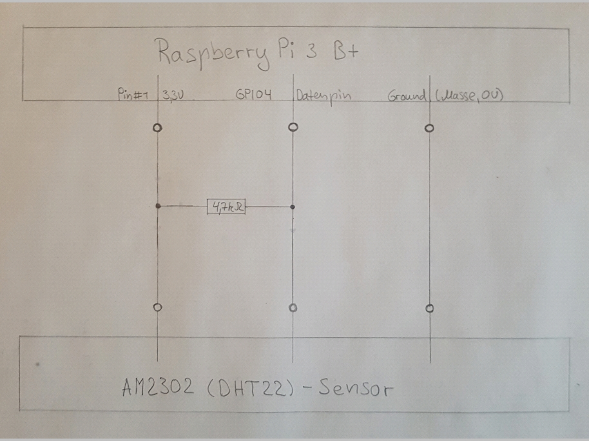
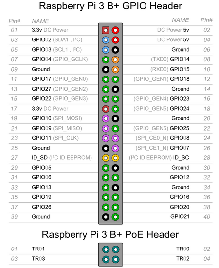
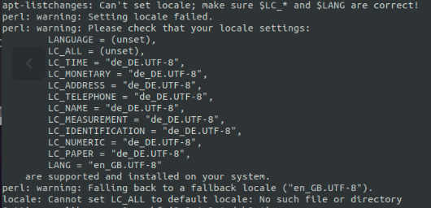

Installtion des Raspberry Pi 3 B+
=================================

.. _offizieller Webseite: https://www.raspberrypi.org/downloads/raspbian/
.. _Link: https://www.datenreise.de/raspberry-pi-kamera-inbetriebnahme/
.. _Raspberry Pi Tutorials: https://tutorials-raspberrypi.de/raspberry-pi-luftfeuchtigkeit-temperatur-messen-dht11-dht22/
.. _Vergleich auf Amazone: https://www.amazon.de/s/ref=nb_sb_noss_2?__mk_de_DE=%C3%85M%C3%85%C5%BD%C3%95%C3%91&url=search-alias%3Daps&field-keywords=DHT22
.. _Informationen: https://www.elektronik-kompendium.de/public/schaerer/pullr.htm
.. _mBlock3: http://www.mblock.cc/mblock-software/
.. _Datenblatt: https://cdn-shop.adafruit.com/datasheets/DHT22.pdf
.. _Adafruit Verzeichnis: https://github.com/adafruit/Adafruit_Python_DHT.git
.. _diesem Link: https://tutorials-raspberrypi.de/raspberry-pi-ueberwachungskamera-livestream-einrichten/
.. _folgender Anleitung: https://nerdchandise.io/blog/raspberry-pi-live-stream/
.. _folgender Webseite: https://www.bitblokes.de/kameramodul-des-raspberry-pi-v4l-treiber-video4linux-und-motion/
.. _DHT22 Anleitung: https://tutorials-raspberrypi.de/raspberry-pi-luftfeuchtigkeit-temperatur-messen-dht11-dht22/

Zunächst einmal habe ich mich mit der unbekannten Bedienung des Raspberry Pi 3 B+ vertraut gemacht. Dazu habe ich sowohl eine kleine Einweisung von meinem Kollegen Alexander H.
bekommen, sowie auch selbst in Erfahrung gebracht wo die grundlegendsten Einstellungen zu finden sind und welches Betriebssystem überhaupt vorliegt. Nachdem bekannt war, dass Rasbian das laufende 
Betriebssystem auf dem R-Pi ist, bin ich zuerst auf deren `offizieller Webseite`_ gewesen und habe gesehen, dass es im wesentlichen nur zwei Unterschiede gibt. Es gibt Rasbian mit und ohne grafischer 
Benutzeroberfläche. In beiden Fällen ist dieses Betriebssystem eine für den Raspberry Pi angepasste Linux-Distribution. Da mein R-Pi schon an einem Bildschirm angeschlossen war, hat es sich erschlossen 
welches Betriebssystem tatsächlich vorlag. Da nun klar war dass der R-Pi ganz einfach mit Linux Terminal-Befehlen bedient werden kann, habe ich mich direkt an die Erfüllung der ersten Aufgabe gemacht.

1. Kamera Modul - Standartvariante
----------------------------------

1 Aufgabe: Raspberry Pi Kameramodul zum laufen bringen bzw. testen wie und ob dieses funktioniert.

Dazu habe ich zunächst im Internet danach gesucht, ob man die Kamera nicht mit den vorhandenen Bordmitteln zum laufen gebracht werden kann, denn diese war schließlich für den R-Pi extra konstruiert 
worden und hatte eine dafür angepasste Schnittstelle (CSI). Daraufhin hat man direkt sehr schnell sehr viele Lösungen bekommen. Es war möglich die Kamera vorsichtig im laufenden Betrieb anzuschließen und zu 
aktivieren. Hierbei entschloss ich mich das Gerät auf jeden Fall auszuschalten und von der Stromversorgung zu lösen um mögliche Schäden oder Fehlfunktionen zu verhindern. Nachdem die Kamera fachgerecht 
angeschlossen war, wurde der R-Pi wieder gestartet. Danach wurde das Konfigurationstool des R-Pi durch den Befehl 

- sudo raspi-config 

aufgesucht um die Kamera unter dem Punkt 5 - “Interfaving Options“ und dann P1 - „Camera“ zu aktivieren. Dabei war die Anleitung die man befolgt hat etwas veraltet und das Konfigurationstool war etwas 
anders aufgebaut, sodass die Untermenüs etwas in den Zeilen vertauscht waren. Eine aktuelle Anleitung, ist unter diesem `Link`_ vorzufinden. Dort habe ich auch die nächsten nötigen Befehle kopiert um 
die Kamera zu testen. Mit dem Befehl 

- raspistill -o testfoto.jpg 

habe ich zunächst ein Testbild gemacht, welches auch gelungen ist. Dieses ist automatisch ins /home Verzeichnis gespeichert worden. 

Ob die Kamera auch Videos machen kann und wie gut die Qualität und FPS tatsächlich ist, wurde direkt im Anschluss mit dem Befehl 

- raspistill -o testvideo.jpg 

geprüft. Auch dieses Vorgehen war erfolgreich und wurde ebenfalls automatisch im /home Verzeichnis gespeichert. 

#.. figure:: img/vid0
#   :name: Erstes Testvideo   
#   :align: center

Mit zusätzlichen Parametern konnten sogar Aufnahmedauer, Speicherverzeichnis 
etc. angepasst werden. Durch Parameter wie zum Beispiel -vf -hf (vertikal und horizontal), konnte die Kamera sogar um 90 Grad gedreht werden, sollte diese in einer anderen Position montiert werden 
als normal üblich, was später durchaus nützlich sein könnte.

2. Temperatur- und Feuchtigkeitssensor
--------------------------------------

Als Nächstes musste der Temperatur- und Feuchtigkeitssensor AM2302 alias DHT22 angeschlossen und getestet werden.

Hierfür wurde folgender Link von `Raspberry Pi Tutorials`_ aufgesucht. Zunächst einmal habe ich alles aufmerksam durchgelesen und nachgeforscht in wie fern ich diese Anleitung benutzen kann, 
da unser vorhandener Sensor im Gegensatz zu den Bildern nur über drei der statt vier auf den Bildern gezeigten Pins verfügte. Dabei gab es im `Vergleich auf Amazone`_ viele DHT22 Sensoren sowohl mit 
vier als auch mit drei Anschlusspins, wobei bei denen mit den vier Anschlüssen einer einfach keine Funktion hatte. Dazu konnte das auf der Tutorialseite mitgelieferte Pythonscript mehrere verschiedene 
Modelle von Sensoren ansprechen. Also hab ich beschlossen diese Anleitung auszuprobieren. Zunächst einmal war nicht ganz klar was mit einem Pull-Up Widerstand gemeint war, so habe ich mir die auf der 
Seite vorhandene Skizze umgezeichnet und versucht mir den dort gebrauchten Pull-Up Widerstand zu erklären. 

Dazu habe ich mir zusätzlich `Informationen`_ im Internet gesucht und habe zwar verstanden dass ein Pull-Up Widerstand die Spannung hochzieht und ein Pull-Down Widerstand das Gegenteil bewirken soll, 
sowie diese verschieden geschaltet werden müssen. Jedoch war trotzdem nicht ganz klar warum ein Widerstand bei einer Signaleingabe benötigt wird. Also habe ich eine kleine Testschaltung mit dem 
Arduino UNO aufgebaut. Dann habe ich ein simples Programm mithilfe von `mBlock3`_ erstellt, bei dem einfach nur eine LED leuchten sollte sobald der Taster gedrückt wird. Anschließen habe ich das 
Programm auf den Arduino UNO geladen.

Arduino UNO Programmcode:

-	#include <Arduino.h>
-	#include <Wire.h>
-	#include <SoftwareSerial.h>
-	
-	double angle_rad = PI/180.0;
-	double angle_deg = 180.0/PI;
-	
-	void setup(){
-	    pinMode(10,OUTPUT);
-	    pinMode(4,INPUT);
-	    digitalWrite(10,0);
-	}

Dann habe ich diese Schaltung sowohl mit Widerstand als auch ohne getestet und festgestellt, dass ohne den Widerstand die LED manchmal von selbst aufleuchtet obwohl der Taster nicht gedrückt ist. 
Nun war klar dass es selbst bei offenem Taster zu zufälligen Ergebnissen kommen konnte, da der Eingang anscheinend bereits eine eigene Spannung besitzt und dieser dadurch keinen eindeutig definierten 
Zustand hat, welcher bei offenem Taster durch anliegende 0V auf das logische LOW gesetzt sein müsste. Durch den Pull-Down Widerstand wird genau dieser Zustand erreicht, da der Eingang auf 0V 
herunterzogen wird. 

#.. figure:: img/vid1.mp4
#   :name: Versuchsvideo
#   :align: center

Messungen mit dem Multimeter haben diese Theorie ebenfalls bestätigt. Nach weiteren Überlegungen und Nachforschungen war klar, das der Pull-Up Widerstand genau das Gegenteil bewirkt und in unserem 
Fall zwischen den 3,3V Pin und dem Datenpin geschaltet ist, damit der Datenpin ein logisches und definiertes HIGH Signal erhält. Zusätzlich habe ich ein ’Blick in das Datenblatt’_ für den DHT22 geworfen 
und gesehen, dass dieser bereits einen eingebauten Pull-Up Widerstand von :math:`2,4\,k\Omega` besitzt, und beschloss nur einen weiteren :math:`4,7\,k\Omega` Widerstand statt den 10k Ohm einzubauen. 
Da es jedoch so viele unterschiedliche Bauarten eines DHT22 gibt, beschloss ich dies nachzumessen. Hiernach viel mir auch auf, dass unser Sensor eigentlich ebenfalls über vier Kontakte verfügt. 
Der Unterschied war, dass dieser auf einer kleineren Platine verbaut ist, welche sich besser in ein sogenanntes Breadboard stecken lässt. Und nur diese Sensoren, 
die über diese zusätzliche Platine verfügen, besitzen auch über einen Pull-Up Widerstand. Bei den Sensoren ohne diese Platine wird das zuschalten eines Pull-Up Widerstanden somit unumgänglich. Durch den 
Bereits vorhandenen Widerstand müsste der Sensor somit auch ohne einen weiteren Widerstand funktionieren, was mein Kollege Alexander H. auch bestätigt hat. Die anfängliche Überlegung dass der Widerstand 
den Sensor vor zu hoher Spannung schützen soll, ist somit komplett verkehrt gewesen, denn der Sensor hat auch einen Vorwiderstand und kommt mit Spannungen zwischen 3,3V DC und 5,5V DC zurecht. Ein Blick 
auf das umgezeichnete Schaltbild, zeigte dass es sich um eine Parallelschaltung handelt. Wie bereits bekannt ist, sind bei Parallelschaltungen die Gesamtspannungen in den Zweigen gleich.

Nachdem alles klar war, wurde die Schaltung mit einem :math:`4,7\,k\Omega` Widerstand nachgebaut, wonach auch das `Adafruit Verzeichnis`_ von Github heruntergeladen und das setup.py wie beschrieben 
installiert wurde. Durch die Installation ist dieses Script einfach nur das Pythonverzeichnis aufgenommen worden und kann zum Beispiel in einem anderen Pythonscript durch die Funktion 

- input 

eingefügt bzw. eingebunden werden. Nun wurde die Funktionalität des Sensors in der aufgebauten Schaltung durch das Ausführen des Pythonscripts überprüft. Dazu muss man sich im selben Verzeichnis 
befinden wo auch das Pythonscript ist und 

- ./AdafruitDHT.py 22 4 

in das Terminal eingeben um dieses auszuführen. Die (22) steht dabei für die Art des Sensors (DHT22) und die (4) für den benutzen GPIO Datenpin am Raspberry Pi. **Dabei ist der GPIO Nummer 4 nicht gleichzeitig 
der Pin Nummer 4 sondern Pin Nummer 7**. **Das darf nicht verwechselt werden!** Sonst kann der Sensor nicht ausgewertet werden, weil der Raspberry Pi dann einen falschen Pin abfragen würde. 
Nachdem der erste Messversuch erfolgreich war, haben wir uns Gedanken um die nächsten Schritte gemacht.
Dabei gibt es mehrere möglichkeiten den DHT22 anzuschließen, diese können folgender Grafik entnommen werden:

3. Verbesserung der Installation des DHT22 Sensors
--------------------------------------------------

Als nächstes haben wir uns überlegt, dass wir die Installation des DHT22 Sensors erleichtern wollen. So habe ich ein Pythonscript geschrieben, welches die Ordner automatisch anlegt, das Script von 
Adafruit herunterlädt, anschließend installiert und den ersten Messversuch startet. Dabei kann die Messung natürlich nur erfolgen, wenn der Sensor auch angeschlossen ist. Andernfalls wird das Script 
ebenso ausgeführt, es kann dann nur keine Messung erfolgen und die Temperatur und Feuchtigkeit wird nicht ausgegeben. Zusätzlich habe ich ein Pythonscript nur für die Messung selbst geschrieben, 
welches die Messung ausführt, unabhängig davon in welchem Verzeichnis man sich gerade befindet. Ausgehend davon, dass dieses Projekt später nachgebaut werden soll und eventuell eine frisch installierte 
Distribution vorliegt, habe ich ebenfalls eine neue Micro-SD Karte mit Rasbian geflasht und das Script ausprobiert um wirklich alle Fehler auszuschließen. Das Script funktionierte einwandfrei bis auf 
Fehlermeldungen, aufgrund von fehlenden Konfigurationseinstellungen. 

Dabei meckert das Terminal zwar mehrfach, dass diese Einstellungen vorgenommen werden sollen, doch das Script wird trotzdem problemlos 
bis zum Ende durchgeführt. Wie man diese Einstellungen vornimmt werde ich im späteren Verlauf dokumentieren. Was mich jedoch nicht ganz zufriedengestellt hat, ist dass bei einem blanken System bei den 
ersten Script-Zeilen erstmals Updates durchgeführt werden und dies teilweise ganz schön lange dauert. Dabei muss der Vorgang ganz oft mit „yes“ bestätigt werden, um etwas zu installieren, 
somit hab ich ein Zusatzparameter 

- --assume-yes 

in die Befehle eingefügt (zum Beispiel sudo apt-get –assume-yes install …) damit alle Anfragen ebenfalls automatisch mit „yes“ bestätigt werden. Hiernach hab ich das ganze erneut mit vorher vorgenommenen 
Konfigurationseinstellungen getestet und alles funktionierte ohne irgendwelches Gemecker und vollautomatisch, wonach auch die erste Messung erfolgreich durchgeführt wurde. Klar wäre es vielleicht 
einfacher gewesen mit einem Shell- oder Bashscript zu arbeiten, da jedoch so ziemlich jede Linux-Distribution über Python (sogar beide, 2 und 3) verfügt und das Script von Adafruit auch in Python 
geschrieben ist, habe ich mich entschlossen das Script ebenfalls als Python zu erstellen um es eventuell besser einbinden zu können und auch um die Python Programmiersprache kennenzulernen. 
Dazu habe ich das Buch mit der ISBN-978-3-658-20704-5 als PDF benutzt, um mich mit der Programmiersprache etwas vertraut zu machen. In den Scripts habe ich ebenfalls vor den entsprechenden Befehlen, 
welche ausgeführt werden sollen, beschrieben was jeweils im Folgenden geschieht bzw. gemacht wird. Diese Zeilen wurden dann mit einem „#“ wie üblich ausgeschlossen, damit das Script diese Zeilen nicht 
versucht auszuführen.

4. Lifestream der Kamera
------------------------

Da die erste Kamera sich anscheinend von selbst verabschiedet hat, haben wir eine neue besorgt. Diese war diesmal eine NoIR Variante statt der Standardkamera und unterscheidet sich darin, dass diese mit 
einer Infrarotbeleuchtung sogar Nachtaufnahmen ermöglicht. Dadurch das diese Kamera keinen eingebauten Infrarotfilter im Gegensatz zu der Standartvariante besitzt, verspricht diese generell bessere 
Aufnahmen bei weniger Licht, die Spezifikationen (Auflösung, etc.) sind dabei identisch. Da diese nun neu war, habe ich diese erstmals auf Funktion geprüft, wie bereits in Punkt 1 beschrieben. 
Im Folgenden haben wir uns wieder der Kamera gewidmet und eine Methode gesucht, mit dessen Hilfe wir einen Kamera Lifestream mit möglichst guter Qualität ermöglichen können. Mit den bereits vorhandenen 
Mitteln konnte man zwar per Befehlseingabe Bilder oder Videos machen - und sogar Lifestreams - jedoch war nicht ersichtlich ob man mit Raspivid den Lifestream auch irgendwie ins Netzwerk übertragen 
bekommt, um diesen auch auf anderen Geräten verfolgen zu können. Auch hier haben wir zunächst nach Ansätzen im Internet geschaut und vieles ausprobiert. Die meisten Ansätze die wir mit Alexander H. 
ausprobiert haben, sollten angeblich mit dem Programm Motion funktioniert. Eine Beispielseite unter mehreren verschiedenen Versuchen ist unter `diesem Link`_ vorzufinden. Ich habe viele verschiedene 
Einstellungen in der Konfigurationsdatei von Motion ausprobiert, doch alles war erfolglos und brachte immer nur maximal 1 FPS. Auch mit den vorhandenen Mittel wie Raspivid funktionierte es nicht, 
bis wir schließlich Erfolg mit `folgender Anleitung`_ hatten. Hier konnte der Lifestream mit einem VLC-Player verfolgt werden. Das funktionierte bisher am besten, mit guter FPS und Videoqualität, 
jedoch war sowohl auf dem Pi 2 als auch auf dem Pi 3 eine Latenz von ca. 2-3 Sekunden nicht gerade zufriedenstellend. Ich hatte noch eine weitere Idee, so habe ich ssh auf dem Pi aktiviert und hab 
darüber von meinem PC aus auf das Terminal des Microcontrollers zugegriffen. Als Nächstes habe ich VLC ebenfalls auf meinem Computer installiert und den Lifestream erfolgreich auf meinem Computer empfangen, 
da ich mich im selben Netzwerk befand. Die Idee war diese Methode ohne die Tastatur, Maus und den HDMI-Anschluss auszuprobieren. Ich hatte gehofft das der R-Pi dadurch mehr Leistung hätte, 
da die USB Slots mit Maus und Tastatur im Betrieb laut Datenblatt bis zu 600 Milliampere ziehen können. Ebenfalls zieht die HDMI-Schnittstelle bis zu 600 Milliampere. Mein Gedanke war, dass durch diese 
Entlastung die Latenz gesenkt werden könnte. Doch selbst nur mit laufender Ethernet-Schnittstelle und laufendem Prozessorkern, was maximal bis zu 1,2 Ampere statt den vorherigen 2,4 Ampere ziehen sollte 
(somit eine nur halb so große Belastung), war die Latenz die selbe. Im nächsten Verlauf ist das Ziel herauszufinden wie die vorhandene Latenz gesenkt werden kann, damit der NIBOBee besser steuerbar ist 
und Hindernisse - gerade beim Kurvenfahren - schneller erkannt werden können.

5. Automatisches starten der Kamerainstallation und des Lifestreams
-------------------------------------------------------------------

Damit die Installation der Kamera schneller abläuft, habe ich auch für diese ein Pythonscript geschrieben. Da die Kamara immer in den Konfigurationseinstellungen (sudo raspi-config) anktiviert werden muss,
habe ich eine Lösung auf `folgender Webseite`_ Befehle gefunden, wodurch die bereits auf jeden Rasbian-System vorhandenen Treiber für die Kamera aktiviert und in den Autostart eingetragen werden, 
damit diese bei einem Neustart automatisch initialisiert werden und die Kamera erkannt wird. Dies gilt ebenso im späteren Verlauf zu testen, ob es auch funktioniert. Der VLC Player wird hierbei, falls nicht 
bereits vorhaben - was standardmäßig sein sollte -, ebenfalls installiert. Das engültige Ziel ist es, dass wenn der Raspberry Pi gestartet wird, der Lifestream vollautomatisch beginnt, sodass der 
Lifestream sich unkompliziert auf einem PC öffnen lässt, dabei muss sich der PC im selben Netzwerk befinden.

Was geschieht als nächstes?
---------------------------

Sobald das Script für die Kamerainstallation getestet wurde und funktioniert, werde ich die Installationsscripte zusammenführen, sodass nur ein Script ausgeführt werden muss um alle für dieses 
Projekt benötigten Programme und Funktionen zu installieren. Das Starten des Lifestream auf den Computer sowie das Durchführung der Messungen kann ebenfalls simple automatisiert werden. Wie in der 
`DHT22 Anleitung`_ bereits erwähnt ist, können die Messungen sogar dauerhaft geloggt werden. Somit liesse sich auch eine Grafik erstellen, auf der Messungen in bestimmten Zeitabständen einen Verlauf abbilden. 
Ob dies sinnvoll wäre, müsste beim nächsten Termin besprochen werden.
Im Vordergrund steht jedoch, dass die Latenz des Lifestreams minimiert werden kann. Diese Aufgaben können natürlich auch aufgeteilt werden.

Die erstellen Pythonscripte
---------------------------

Dies ist das Script, welches Updates durchführt, den DHT22 Sensor installiert und testet.
^^^^^^^^^^^^^^^^^^^^^^^^^^^^^^^^^^^^^^^^^^^^^^^^^^^^^^^^^^^^^^^^^^^^^^^^^^^^^^^^^^^^^^^^^

- #!/usr/bin/python
- # coding: utf8
- 
- # Updates checken und installieren:
- import os
- print os.system('sudo apt-get --assume-yes update');
- print os.system('sudo apt-get --assume-yes upgrade');
- print os.system('sudo apt-get --assume-yes autoremove');
- 
- # Zunaechst werden einige Packete installiert:
- print os.system('sudo apt-get --assume-yes install build-essential python-dev python-openssl git');
- 
- # Verzeichnis fuer die Bibliotheken wird erstellt und aufgesucht:
- print os.system('mkdir /home/pi/Sensoren-Temp-Feucht');
- print os.chdir('/home/pi/Sensoren-Temp-Feucht');
- 
- # Bibliothek fuer die Sensoren wird geladen und eine Phyton Bibliothek angelegt:
- print os.system('git clone https://github.com/adafruit/Adafruit_Python_DHT.git');
- print os.chdir('/home/pi/Sensoren-Temp-Feucht/Adafruit_Python_DHT');
- print os.system('sudo python setup.py install');
- 
- # In den Ordner "examples" wechseln, welcher Bestandteil der
- #herruntergeladenen Bibliothek ist:
- print os.chdir('/home/pi/Sensoren-Temp-Feucht/Adafruit_Python_DHT/examples');
- 
- # Sofern man sich nun in dem Verzeichnis /home/pi/Documents/Sensoren-Temp-Feucht/
- # befindet und der Sensor nach Anleitung angeschlossen ist, kann mit dem
- #folgenden Befehl die Temperatur und die Feuchtigkeit gemessen werden:
- 	#sudo ./AdafruitDHT.py 22 4
- # Hierbei steht die "22" fuer das Sensormodel DHT22 und die "4" fuer
- #GPIO Nummer 4. Wird ein anderer Sensor verwendet muss die Zahl "22"
- #dementsprechen angepasst werden, dasselbe betrifft auch die GPIO Schnittstelle.
- 
- # Im Folgenden wird die erste Testmessung auch direkt durchgefuehrt,
- # sofern der Sensor richtig angeschlossen ist:
- print os.system('./AdafruitDHT.py 22 4');
- 
- # Sollten weitere Messungen durchgefuehrt werden, muss das andere Script
- #Namens messung.py ausgefuehrt werden. Dabei wird das richtige Verzeichnis
- #automatisch aufgesucht.

Mit folgendem Script können weitere Messungen durchgeführt werden, unabhängig davon in welchem Verzeichnis man sich gerade befindet.
^^^^^^^^^^^^^^^^^^^^^^^^^^^^^^^^^^^^^^^^^^^^^^^^^^^^^^^^^^^^^^^^^^^^^^^^^^^^^^^^^^^^^^^^^^^^^^^^^^^^^^^^^^^^^^^^^^^^^^^^^^^^^^^^^^^^

- #!/usr/bin/python
- # coding: utf8
- 
- # Hier wird das fier die Messung benoetigte Verzeichnis von Adafruit aufgesucht:
- import os
- print os.chdir('/home/pi/Sensoren-Temp-Feucht/Adafruit_Python_DHT/examples');
- 
- # Und andschliessend wird das sich darin befindende, vorher herruntergelade,
- # Python-Script von Adafruit ausgefuehrt, womit die Abfrage des Sensors
- #DHT22 erfolgt.
- import os.system('./AdafruitDHT.py 22 4');
- 
- # Hierbei steht die "22" fuer das Sensormodel DHT22 und die "4" fuer
- #GPIO Nummer 4. Wird ein anderer Sensor verwendet muss die Zahl "22"
- #dementsprechen angepasst werden. Dasselbe betrifft auch die GPIO Schnittstelle.

